<!-- Please do not change this logo with link -->

# Dynamic Switching between SPI and I2C Modes of MSSP Peripheral using PIC16F15276 microcontroller

This application demonstrates the use of Master Synchronous Serial Port (MSSP) in real-time applications. This demo's purpose is to perform the dynamic switching between the Serial Peripheral Interface (SPI) and Inter-Integrated Circuit (I2C) modes, using MSSP.

## Introduction

The PIC16F152xx family of microcontrollers (MCUs) provides a simplified set of features. These MCUs are equipped with one MSSP, which can be configured in SPI or 7/10 bit addressing I2C mode. This example describes the implementation of dynamic switching between SPI and I2C modes of single MSSP peripheral of PIC16F15276 MCU. The single MSSP peripheral is used to interface an I2C sensor and SPI LCD to the MCU.

## Related Documentation

- [PIC16F15276 Product Page](https://www.microchip.com/en-us/product/PIC16F15276 "PIC16F15276 Product Page")
- [PIC16F152xx Family Product Brief](https://ww1.microchip.com/downloads/en/DeviceDoc/40002140A.pdf "PIC16F152xx Family Product Brief")
- [PIC16F15244 Code Examples on GitHub](https://github.com/microchip-pic-avr-examples "PIC16F15244 Code Examples on GitHub")
- [PIC16F152xx MCU Family Video](https://youtu.be/nHLv3Th-o-s "PIC16F15244 MCU Family Video")

## Description

In this example, the PIC16F15276 Curiosity Nano Board, LCD mini click and Heart Rate click from MikroElektronika are used for demonstrating dynamic switching between SPI and I2C modes of MSSP. Multiple applications require the SPI and I2C interfaces to work in parallel, PIC16F15276 MCU has a single MSSP peripheral, which can be configured in either SPI or I2C mode on the go for the efficient usage of the MSSP peripheral.
	

  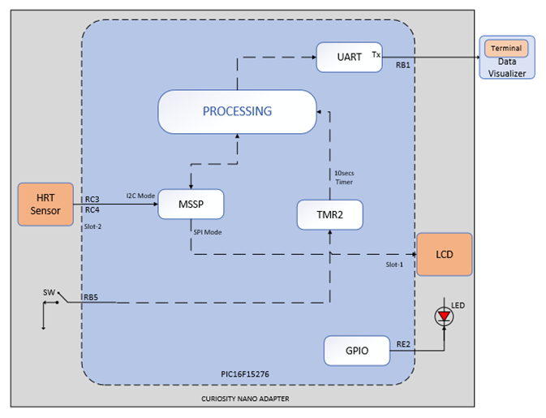
   Figure 1: Block Diagram 

During the data acquisition and calculation, the first two set of buffer data read cycles are completed, and then the post processing on the raw data is initiated. The first cycle undergoes DC filtering, followed by Low-Pass Butterworth Filter. This data is then passed through an 8 set summation filter. The post processing is required for a clear data identification (also proper ECG type of display if required in future).

# Heart Rate Measurement

This section demonstrates the heart rate measurement feature based on MAX30100 I2C heart rate sensor. The user initiates the pulse signal by pressing on the MAX30100 sensor. The sensor comprises two LEDs, a photo sensor, optimized optics, and a low noise analog signal processing, which detects pulses. The Serial Data (SDA) and Serial Clock (SCL) of the I2C transmit the data from the sensor to the MCU. The sensor's raw data is processed by the firmware, then the heart rate is calculated and displayed on the LCD's interface, then passes to the MCU using SPI.

The Heart rate click from MikroElektronika uses the MAX30100, an integrated pulse oximetry and heart rate monitor sensor. It combines two LEDs, a photodetector, optimized optics, and a low-noise analog signal processing, which detect the pulse oximetry and the heart rate signals. The MAX30100 operates from 1.8V and 3.3V power supplies and can be powered down through software with negligible standby current, permitting the power supply to remain connected throughout the time. It is used for obtaining the raw pulse data from the IR LED of the sensor.

  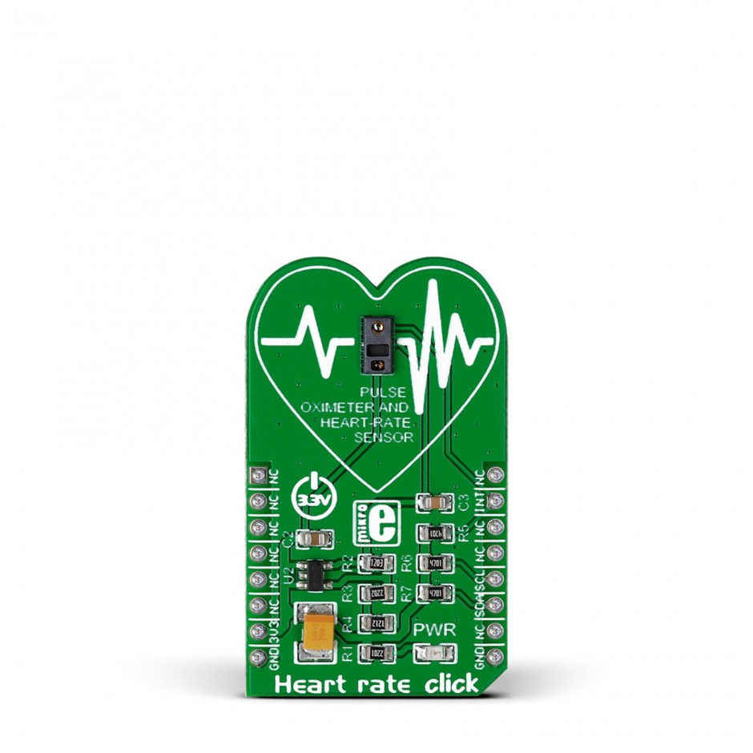
   Figure 2: Heart Rate Click 

  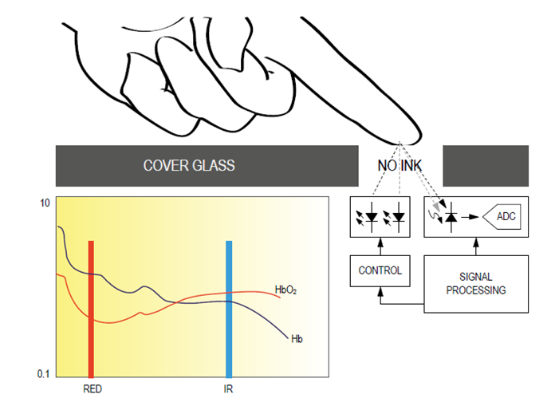
   Figure 3: Heart Rate Measurement 

The parameters used to initialize the MAX30100 sensor data are:

Mode - HR Only (Heart Rate only)

  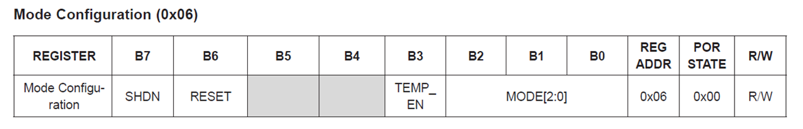
   Figure 4: MAX30100 Mode Register 

High Resolution requires to be enabled along with sample rate and LED Currents.

  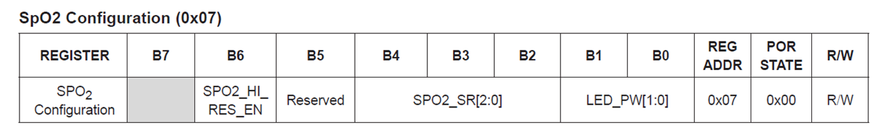
   Figure 5: MAX30100 SpO2 Register 

The sample rate and samples per second's combination sets up the resolution of the internal Analog-to-Digital (ADC) to 16-bit and pulse width of 1.6 ms.

  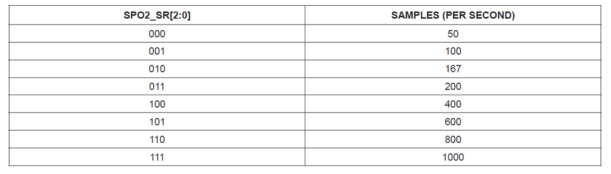
   Figure 6: MAX30100 Sample Rate 

  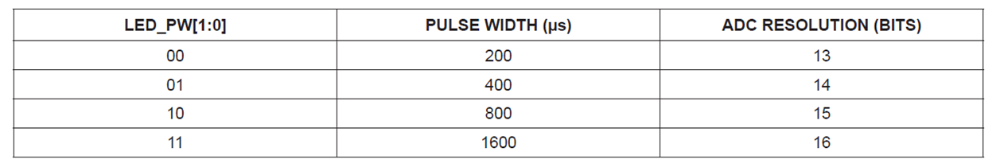
   Figure 7: MAX30100 Resolution 

For reading the samples from the sensor, the internal FIFO flag must be enabled to read the sensor's samples. Each sample constitutes 4 data bytes, creating a data reading cycle composed of 16 samples, from a total of 64 data bytes. The manner in which the bytes of data are read is represented below.

  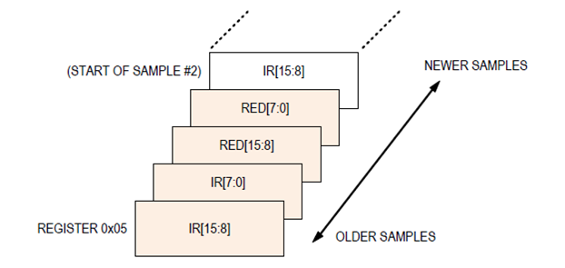
   Figure 8: FIFO Data Register Representation 

## Software Used

Microchip's XC8 Complier and MPLAB® Code Configurator (MCC) are used throughout the application firmware development.

* [MPLAB X IDE](https://www.microchip.com/mplab/mplab-x-ide) v6.15.0
* [XC8 Compiler](https://www.microchip.com/mplab/compilers) v2.45.0
* [MPLAB Code Configurator (MCC)](https://www.microchip.com/mplab/mplab-code-configurator) v5.3.7
* TMR2 MCC Melody driver 4.0.17
* EUSART MCC Melody driver 7.1.5
* I2C Host MCC Melody driver 1.0.4
* [Microchip PIC16F1xxxx Series Device Support](https://packs.download.microchip.com/) 1.23.382 or newer

Note: For running the demo, the installed tool versions should be same or later. This example is not tested with previous versions.

## Hardware Used

* [Curiosity Nano Base for Click boards™](https://www.microchip.com/en-us/development-tool/AC164162)
* [PIC16F15276 Curiosity Nano Evaluation Kit](https://www.microchip.com/en-us/product/PIC16F15276)
* [Heart Rate Click](https://www.mikroe.com/heart-rate-click)
* [LCD Mini Click](https://www.mikroe.com/lcd-mini-click)

## Hardware setup
The following figure shows the detailed information about the hardware setup.

  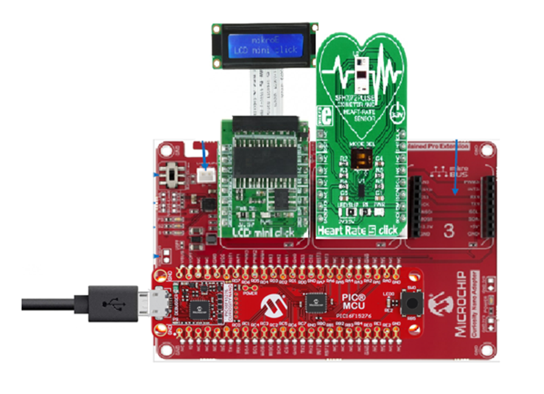
   Figure 9: Hardware Setup 

Dynamic Switching between SPI and I2C modes demonstration needs input from the user in form of raw heartrate data and the output data is in human readable format on the LCD Display as well as terminal. The output is in human readable format and is read by switching the MSSP mode to SPI and displaying the heartrate on the LCD Display.

The required hardware connections are shown in the preceding figure. The figure consists of the Heart rate click, LCD mini click, Curiosity Nano Adapter board and the PIC16F15276 Curiosity Nano Evaluation kit.

## Operation

* Dynamic Switching between SPI and I2C modes demonstration needs input from the user in the form of raw heart rate data. The output is in human-readable format on the LCD Display, as well as terminal. The hardware connections are made as shown in the Hardware Setup. Power up the Curiosity Nano Adapter board using micro USB cable.
* Download the firmware available from the GitHub page link.
* Build the project using latest version of tools as mentioned in the Software Tools section and load the generated hexadecimal file in to the PIC16F15276 MCU.
* After running the program, initially the LCD display will display the project name along with the step to proceed, as shown below.

  
   Figure 10: Default Display Screen 

* The initial message is displayed on the LCD display, where the MSSP mode changes from I2C (which is default) to SPI for the message to pop up on LCD Display.
* User needs to keep his index finger on the sensor and press the switch to start measuring the heartrate. User needs to hold his finger on the sensor for 10secs. As soon as switch is pressed the MSSP mode rolls back to I2C and receives the data from the sensor.

  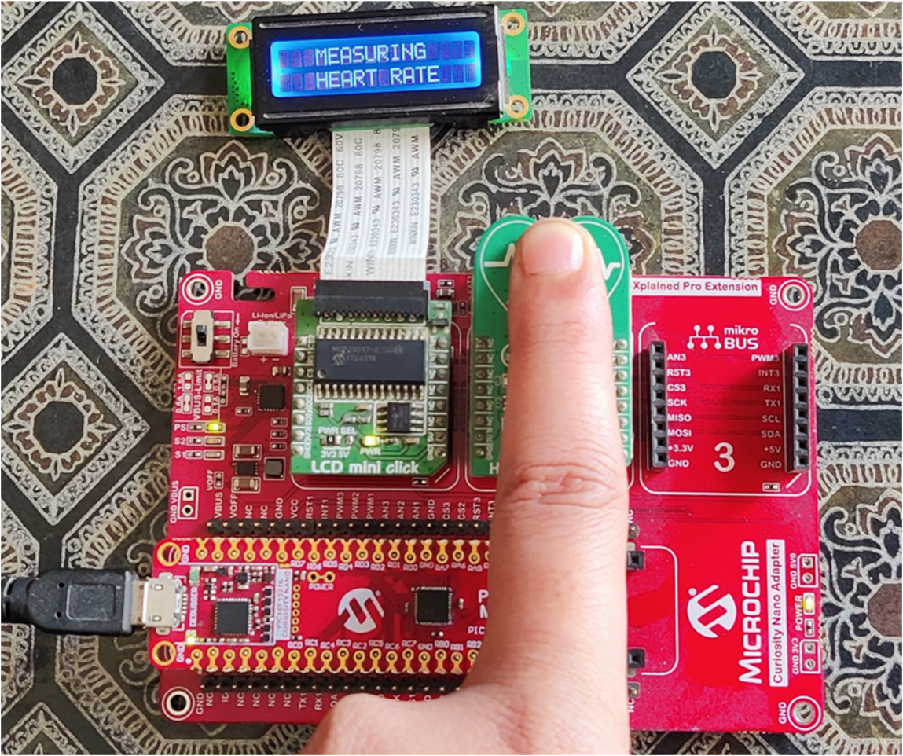
   Figure 11: Data measuring 

* Visual notification LED starts blink as soon as the timer starts and internal buffer of the sensor is read to collect the raw heart rate data.
* As soon as the first two set of buffer data read cycles are completed, the post processing on the raw data is initiated. It undergoes DC filtering at first stage, followed by Low Pass Butterworth Filter. This data is then passed through a 8 set summation filter. The post processing is required for clear identification of data (also proper ECG type of display if required in future).
* After 10 seconds the processed data is displayed on the LCD Display. For displaying the data, MSSP again is switched dynamically to SPI Mode for specific duration and restored to I2C mode once completed for making it available into initial condition.

  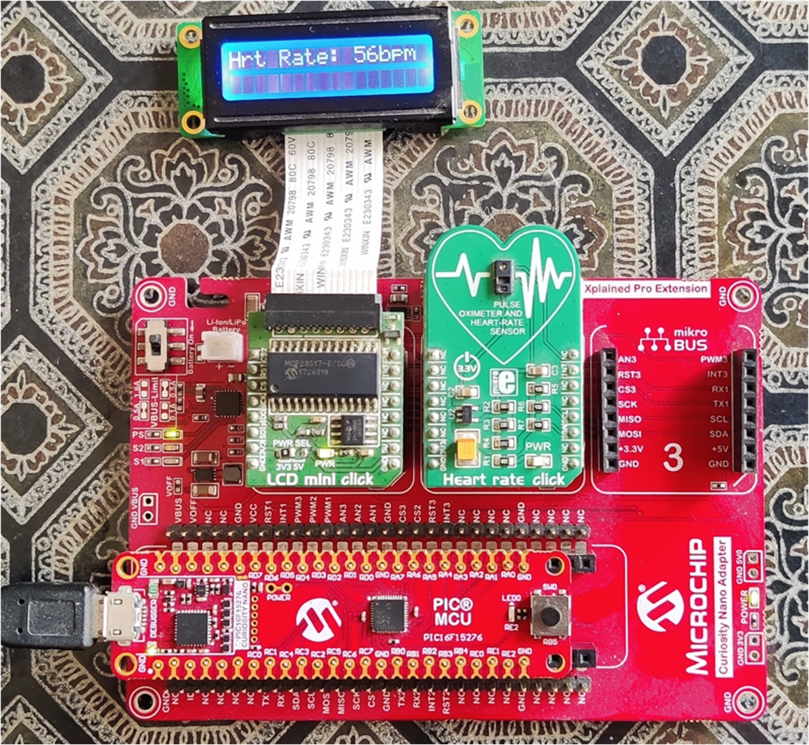
   Figure 12: Result Window 

## Conclusion
The real time applications based on SPI or I2C can be performed on enormous range of controllers available all around. So the base idea of this example is to explore the possibilty of the PIC16F15276, having a single MSSP to dynamically switch between SPI and I2C modes. The data may vary a bit with respect to actual heartrate devices in the market but the main focus of dynamic mode switching is achieved.