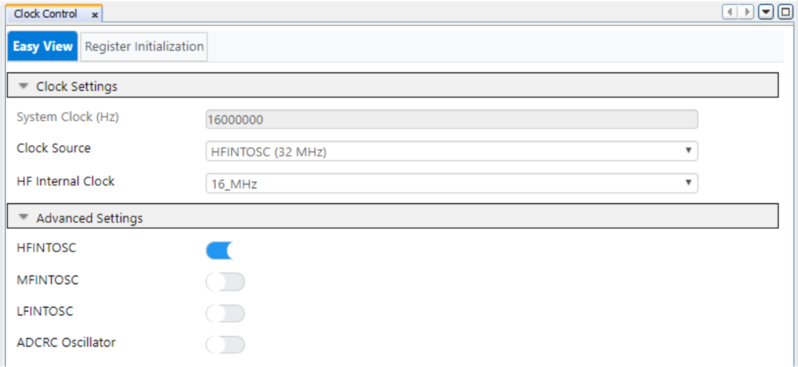
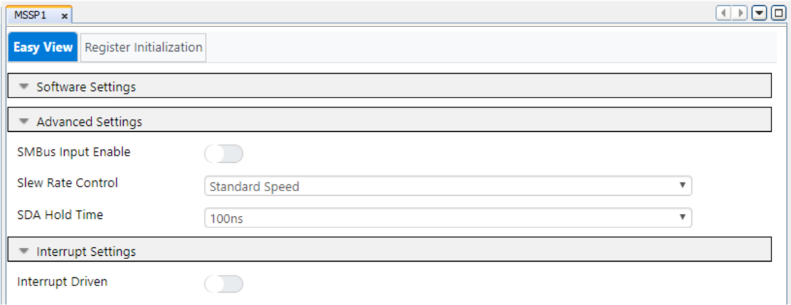
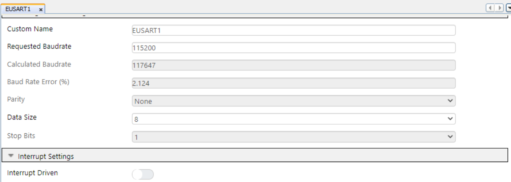
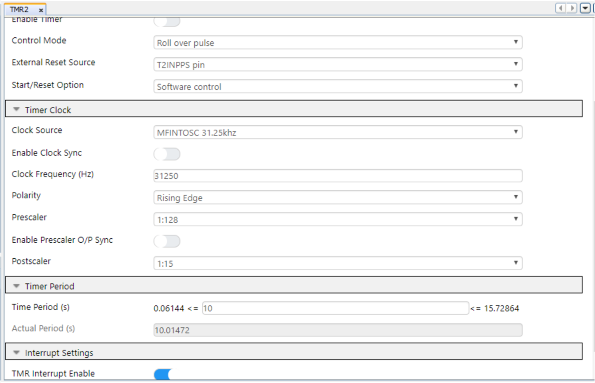
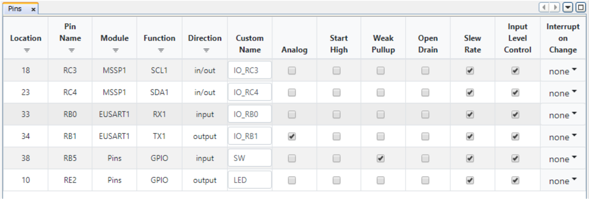

<!-- Please do not change this logo with link -->

# Dynamic Switching between SPI and I2C Modes of MSSP Peripheral using PIC16F15276 microcontroller

This application demonstrates use of MSSP in real time applications. In this demo, we will realize dynamic switching between SPI and I2C modes using MSSP.

## Introduction

The PIC16F152xx family of microcontrollers (MCUs) provides simplified set of features. These MCUs are equipped with one Master Synchronous Serial Port (MSSP) which provides option of configuring it in SPI or 7/10 bit addressing I2C mode. This example describes the implementation of dynamic switching between SPI and I2C modes of single MSSP peripheral of PIC16F15276 MCU. The single MSSP peripheral is used  to interface an I2C sensor and SPI LCD to the microcontroller.

## Related Application Note(s)

- [PIC16F15276 Product Page](https://www.microchip.com/en-us/product/PIC16F15276 "PIC16F15276 Product Page")
- [PIC16F152xx Family Product Brief](https://ww1.microchip.com/downloads/en/DeviceDoc/40002140A.pdf "PIC16F152xx Family Product Brief")
- [PIC16F15244 Code Examples on GitHub](https://github.com/microchip-pic-avr-examples "PIC16F15244 Code Examples on GitHub")
- [PIC16F15244 MCU Family Video](https://youtu.be/nHLv3Th-o-s "PIC16F15244 MCU Family Video")

## Description

In this example, PIC16F15276 curiosity nano board, LCD mini click and Heartrate Click from MikroElektronika are used for demonstrating dynamic switching between SPI and I2C modes of MSSP. Multiple applications require the SPI and I2C interfaces to work in parallel, PIC16F15276 MCU has a single MSSP peripheral which can be configured in either SPI or I2C mode on the go for the efficient usage of MSSP peripheral.
	

  
   Figure 1: Block Diagram 

During the data acquisition and calculation, the first two set of buffer data read cycles are completed and then the post processing on the raw data is initiated. It undergoes DC filtering at first stage followed by Low Pass Butterworth Filter. This data is then passed through an 8 set summation filter. The post processing is required for clear identification of data (also proper ECG type of display if required in future).

# Heartrate Measurement

This section demonstrates the heartrate measurement feature based on MAX30100 I2C heartrate sensor. The pulse signal is taken from the user, when user keeps his/her index finger or thumb on the MAX30100 sensor, which comprises of two LEDs, a photo sensor, optimized optics, and low-noise analog signal processing to detect pulses. The data from the sensor is provided to the microcontroller using the I2C(SDA and SCL) pins. The firmware processes the raw data from the sensors and calculates heartrate and displays it on the LCD interfaced to the MCU using SPI.

The Heartrate Click from MikroElektronika has the MAX30100 is an integrated pulse oximetry and heartrate monitor sensor solution. It combines two LEDs, a photodetector, optimized optics, and low-noise analog signal processing to detect pulse oximetry and heart-rate signals. The MAX30100 operates from 1.8V and 3.3V power supplies and can be powered down through software with negligible standby current, permitting the power supply to remain connected throughout time. It is used for obtaining the raw pulse data from the IR LED of the sensor.

  
   Figure 2: Heartrate Click 

  
   Figure 3: Heartrate Measurement 

The different parameters considered for initializing the MAX30100 sensor data are:

Mode - HR Only (Heartrate only)

  
   Figure 4: MAX30100 Mode Register 

High Resolution requires to be enabled along with sample rate and LED Currents.

  
   Figure 5: MAX30100 SpO2 Register 

The combination of sample rate and samples per second, sets up the resolution of internal ADC to 16-bit and pulse width of 1.6ms.

  
   Figure 6: MAX30100 Sample rate 

  
   Figure 7: MAX30100 Resolution 

For reading the samples from the sensor, internal FIFO flag needs to be enabled. Also each sample constitutes 4 bytes of data making a single cycle of data reading comprising of 16 samples of total 64 bytes of data. The manner in which the bytes of data are read is represented below.

  
   Figure 8: FIFO Data Register Representation 

## Software Used

Microchip’s free IDE, compiler and graphical code generators are used throughout the application firmware development. Following are the tools used for this demo application:

* MPLAB X IDE [v6.00.0](https://www.microchip.com/mplab/mplab-x-ide)
* XC8 Compiler [v2.36.0](https://www.microchip.com/mplab/compilers)
* MPLAB Code Configurator (MCC) [v5.0.3](https://www.microchip.com/mplab/mplab-code-configurator)
* TMR2 MCC Melody driver 4.0.10
* UART MCC Melody driver 1.6.0
* MCC Melody Core 2.1.9
* I2C Host MCC Melody driver 1.0.2
* Microchip PIC16F1xxxx Series Device Support [1.9.163 or newer](https://packs.download.microchip.com/)

***Note: For running the demo, the installed tool versions should be same or later. This example is not tested with previous versions.***

## Hardware Used

* [Curiosity Nano Base for Click boards™](https://www.microchip.com/en-us/development-tool/AC164162)
* [PIC16F15276 Curiosity Nano Evaluation Kit](https://www.microchip.com/en-us/product/PIC16F15276)
* [Heart Rate Click](https://www.mikroe.com/heart-rate-click)
* [LCD Mini Click](https://www.mikroe.com/lcd-mini-click)

## Hardware setup
The following figure shows the detailed information about the hardware setup.

  
   Figure 9: Hardware Setup 

Dynamic Switching between SPI and I2C modes demonstration needs input from the user in form of raw heartrate data and the output data is in human readable format on the LCD Display as well as terminal. The output is in human readable format and is read by switching the MSSP mode to SPI and displaying the heartrate on the LCD Display.

The required hardware connections are shown in the preceding figure. The figure consists of Heartrate Click, LCD mini Click, Curiosity Nano Adapter Board and PIC16F15276 Curiosity Nano Evaluation kit.

## Operation

* **Dynamic MSSP Mode Switching Pin Mapping** consists of pin mapping/connection details of the Real-Time Clock demonstration setup. The hardware connections are made as shown in the Hardware Setup. Power up the Curiosity Nano Adapter board using micro USB cable.
* Download the firmware available from the github page link.
* Build the project using latest version of tools as mentioned in the Software Tools section and load the generated hexadecimal file in to the PIC16F15276 MCU.
* After running the program, initially the LCD display will display the project name along with the step to proceed as shown below,

  
   Figure 10: Default Display Screen 

* The initial message is displayed on the LCD display, where the MSSP mode changes from I2C(which is default) to SPI for the message to pop up on LCD Display.
* User needs to keep his index finger on the sensor and press the switch to start measuring the heartrate. User needs to hold his finger on the sensor for 10secs. As soon as switch is pressed the MSSP mode rolls back to I2C and receives the data from the sensor.

  
   Figure 11: Data measuring 

* Visual notification LED starts blink as soon as the timer starts and internal buffer of the sensor is read to collect the raw heartrate data.
* As soon as the first two set of buffer data read cycles are completed the post processing on the raw data is initiated. It undergoes DC filtering at first stage followed by Low Pass Butterworth Filter. This data is then passed through a 8 set summation filter. The post processing is required for clear identification of data (also proper ECG type of display if required in future).
* At end of 10secs the processed data is displayed on the LCD Display. For displaying the data, MSSP again is switched dynamically to SPI Mode for specific duration and restored to I2C mode once completed for making it available into initial condition.

  
   Figure 12: Result Window 

## Conclusion
The real time applications based on SPI or I2C can be performed on enormous range of controllers available all around. So the base idea of this example is to explore the possibilty of the PIC16F15276, having a single MSSP to dynamically switch between SPI and I2C modes. The data may vary a bit with respect to actual heartrate devices in the market but the main focus of dynamic mode switching is achieved.

## Appendix

MCC – MPLAB® Code Configurator is a graphical programming environment that generates seamless, easy to understand C code to give a head start to the project, saving the designer’s time to initialize and configure all the modules, and to go through the datasheets. Using an instructive interface, it enables and configures all peripherals and functions specific to the application requirements.

MCC is used for this demo to create the initialization and peripheral configuration code:

* System configuration for clock settings
* MSSP configuration for I2C and SPI Communication
* EUSART configuration
* Timer configuration

## System configuration

The system configuration window of MCC is used for MCU oscillator, Watchdog timer and low voltage programming configuration. Internal oscillator HFINTOSC(32MHz) set for 1MHz frequency is used as a system clock and the Watchdog timer is disabled in the application.

The following figure shows the system configuration setting in MCC tool.

  
   Figure 13: System Configuration Settings in MCC tool 

## MSSP Configuration

The configuration needed for Heartrate Click is, selection of appropriate I2C mode, pins and I2C communication speed. The curiosity Nano Adapater Board mikroBUS slot 2 is used for Heatrate Click, I/O pins for the same are selected through pin manager.

  
   Figure 14: MSSP Configuration Settings in MCC tool 

## EUSART Configuration

For displaying the basic heartrate count for verifying and debugging purposes, the configuration needed for configuring EUSART is, selection of relevant Baud Rate and redirecting STDIO to USART.

  
   Figure 15: EUSART Configuration Settings in MCC tool 

## Timer Configuration

  
   Figure 16: Timer Configuration 

## Pin Mapping

  
   Figure 17: Pin Configuration 

The SDA and SCL pins are utilized for I2C communication with the Heartrate Sensor. The switch is interfaced to provide the trigger for measuring the heartrate of the user, while LED blinking acts as a visual indication of measuring heartrate process. The SPI pins are configured within the code as the MSSP can only be configured in one mode in the MCC. So the I/O pins are configured in software itself dynamically.
